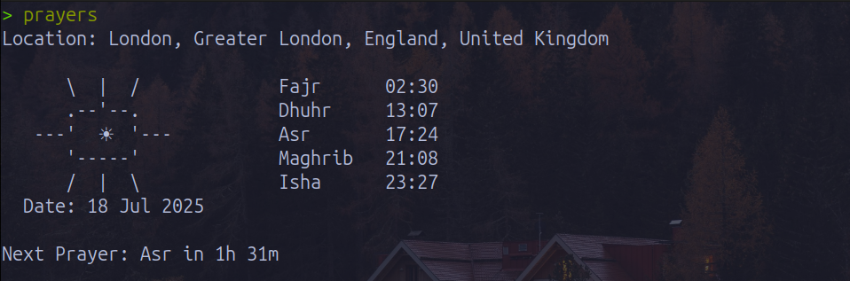

# Prayers CLI

A command-line tool to check Islamic prayer times by city
<br>

<div align="center">
  
</div>

## Features

- Prayer times by city
- Shows upcoming prayer
- Time-based ASCII art (Morning, Night)
- Cozy, eye-comfortable terminal style
- Remembers your last configured city

## Preview

## Prerequisites

Make sure you have Go installed.

To verify Go is installed:

```bash
go version
```

## Installation

```bash
# Clone the repo
git clone https://github.com/OmarAshour02/prayer-cli.git
cd prayer-cli
go build -o prayers
```

### Option 1: Global install

```bash
# Move the binary to a directory in your PATH
sudo mv prayers /usr/local/bin/
```

### Option 2: Run locally

```bash
cd prayer-cli
./prayers
```

## Usage

After installation (assuming global installation), run:

```bash
prayers
```

This will fetch prayer times using default city "Makkah", unless you configure your selected city

### Set or change your saved city

Use the --city or -c flag to set (or change) your default city:

```bash
prayers --city "Dublin"
```

Or shorthand:

```bash
prayers -c "Cairo"
```

Once set, the city will be remembered for future runs.

### Set calculation method

Use the --method or -m flag to specify the Islamic prayer time calculation method:

```bash
prayers --method "2"
```

Or shorthand:

```bash
prayers -m "4"
```

Available calculation methods:

- **0** - Jafari / Shia Ithna-Ashari
- **1** - University of Islamic Sciences, Karachi
- **2** - Islamic Society of North America
- **3** - Muslim World League
- **4** - Umm Al-Qura University, Makkah
- **5** - Egyptian General Authority of Survey (Default)
- **7** - Institute of Geophysics, University of Tehran
- **8** - Gulf Region
- **9** - Kuwait
- **10** - Qatar
- **11** - Majlis Ugama Islam Singapura, Singapore
- **12** - Union Organization islamic de France
- **13** - Diyanet İşleri Başkanlığı, Turkey
- **14** - Spiritual Administration of Muslims of Russia
- **15** - Moonsighting Committee Worldwide
- **16** - Dubai (experimental)
- **17** - Jabatan Kemajuan Islam Malaysia (JAKIM)
- **18** - Tunisia
- **19** - Algeria
- **20** - KEMENAG - Kementerian Agama Republik Indonesia
- **21** - Morocco
- **22** - Comunidade Islamica de Lisboa
- **23** - Ministry of Awqaf, Islamic Affairs and Holy Places, Jordan
- **99** - Custom. See https://aladhan.com/calculation-methods

### Combine flags

You can also combine both flags to set city and method together:

```bash
prayers -c "London" -m "3"
```
